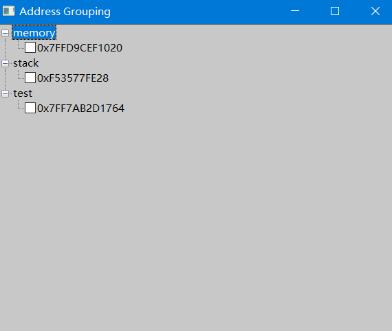

[中文说明请点击这里 (README_zh.md)](README_zh.md) 

# x64dbg Address Grouping Plugin

## Introduction

This plugin provides powerful address grouping and management features for the x64dbg debugger. It allows you to group, annotate, and manage addresses from the disassembly, memory, and stack windows, greatly improving debugging efficiency.

## Main Features

- **Address Group Management**: Create custom groups and add addresses to any group (e.g., memory, stack, CPU, etc.).
- **Multi-Window Support**: Add selected addresses from the disassembly, memory, or stack windows directly to groups.
- **Tree View Display**: All groups and addresses are displayed in a hierarchical tree structure, supporting multi-level child nodes (call chains/relations).
- **Annotations**: Add comments to any address, with green-highlighted annotation display.
- **Child Node Management**: Add child nodes to any address to build call chains or data relationships.
- **Group/Address Deletion**: Quickly delete groups or addresses via the context menu.
- **Import/Export Groups**: Export all groups, annotations, and child node relationships to a text file, and import them back at any time.
- **Breakpoint Integration**: Easily set or remove breakpoints by checking/unchecking nodes.

## Usage

1. **Load the Plugin**: Copy the compiled DLL to the `plugins` directory of x64dbg and restart x64dbg.
2. **Main Menu Entry**: Find the "Address Grouping" entry under the "Plugins" menu in x64dbg.
3. **Group Management Window**: Click to open the main window, where all groups and addresses are shown in a tree view.
4. **Add Address to Group**:
   - Select an address in the disassembly, memory, or stack window, then right-click and choose "add ... to group".
   - You can also add child nodes via the context menu in the main window.
5. **Annotations & Deletion**: Right-click address nodes to add annotations, delete addresses, or add child nodes.
6. **Import/Export**: Use the main window menu to import/export group configurations.

## Highlights
- The `memory` and `stack` groups are dedicated to the memory and stack windows, and double-clicking nodes will jump to the corresponding window.
- Supports multi-level child nodes, ideal for managing call chains, data flows, and complex relationships.
- Simple and intuitive user interface.

## Planned/Upcoming Features
- Annotation green highlighting (not currently supported, will be improved in future versions).

## Installation
1. Build the project to generate the DLL file.
2. Copy the DLL to the `plugins` directory of x64dbg.
3. Restart x64dbg to load the plugin automatically.

## Compatibility
- Supports the latest version of x64dbg. Recommended for use on Windows 10/11.

## License
This project is licensed under the MIT License. Contributions are welcome.

## Contact
For suggestions or bug reports, please submit an Issue on the GitHub repository. 