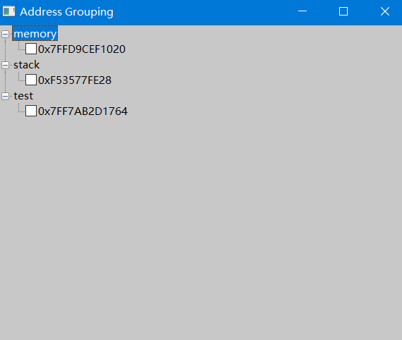

# x64dbg Address Grouping 插件

## 简介

本插件为 x64dbg 调试器提供了强大的地址分组与管理功能，支持将反汇编窗口、内存窗口、栈窗口中的地址分组、批量管理、备注、导入导出等操作，极大提升调试效率。

## 版本历史

### v1.1 (最新版)
- **窗口尺寸优化**：默认窗口大小调整为1000x800，提供更好的可视性
- **中文支持改进**：优化中文注释和分组名的显示处理
- **Bug修复**：
  - 修复添加子节点时无效地址导致的崩溃问题
  - 解决中文注释编码显示问题
  - 修复TreeView控件兼容性问题
- **代码优化**：改进TreeView刷新逻辑和内存管理
- **错误处理增强**：添加地址选择验证，防止添加无效子节点

### v1.0
- 初始版本，包含核心地址分组功能

## 主要功能

- **地址分组管理**：支持自定义分组，将地址添加到任意分组（如 memory、stack、CPU等）。
- **多窗口支持**：可直接从反汇编窗口、内存窗口、栈窗口选中地址并添加到分组。
- **树状视图展示**：所有分组和地址以树状结构展示，支持多级子节点（调用链/关系链）。
- **备注功能**：为每个地址添加备注，备注内容绿色高亮显示。
- **子节点管理**：支持为任意地址添加子节点，形成调用链或关系链。
- **分组/地址删除**：支持右键菜单快速删除分组或地址。
- **分组导入导出**：支持将分组、备注、子节点关系导出为文本文件，亦可导入恢复。
- **断点联动**：可通过勾选/取消勾选节点快速设置/移除断点。
- **国际化支持**：更好地支持中文等非ASCII字符在注释和分组名中的使用。

## 使用方法

1. **加载插件**：将编译好的DLL放入x64dbg的`plugins`目录，重启x64dbg。
2. **主菜单入口**：在x64dbg主菜单"Plugins"下找到"Address Grouping"入口。
3. **分组管理窗口**：点击后弹出分组管理主窗口，所有分组和地址以树状结构展示。
4. **添加地址到分组**：
   - 在反汇编/内存/栈窗口选中地址，右键菜单选择"add ... to group"即可。
   - 也可在主窗口右键节点，添加子节点。
5. **备注与删除**：右键地址节点可添加备注、删除地址、添加子节点等。
6. **导入导出**：主窗口菜单支持导入/导出分组配置。

## 特色说明
- memory分组、stack分组分别服务于内存窗口和栈窗口，双击节点会自动跳转到对应窗口。
- 支持多级子节点，适合管理调用链、数据流等复杂关系。
- 插件界面简洁，操作直观。
- 优化的窗口尺寸为复杂调试场景提供更好的可视性。
- 改进的字符编码支持，更好地服务国际用户。

## 正在开发/计划功能
- 备注内容绿色高亮显示（当前版本暂不支持，后续完善）。
- 更多语言支持和本地化。

## 安装方法
1. 编译本项目，生成DLL文件。
2. 将DLL复制到x64dbg的`plugins`目录。
3. 重启x64dbg即可自动加载插件。

## 兼容性
- 支持x64dbg最新版，建议在Windows 10/11下使用。
- 改进对各种字符编码和国际区域设置的兼容性。

## 开源协议
本项目采用MIT协议，欢迎二次开发与贡献。

## 联系方式
如有建议或Bug反馈，请在GitHub仓库提交Issue。 